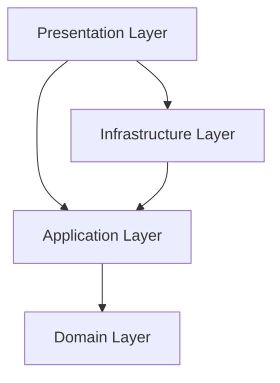

# 🛒 E-Commerce Platform API

<div align="center">


Enterprise-grade **E-Commerce Web API** built with **.NET 8**, **ASP.NET Core Web API**, and **Clean Architecture (DDD Principles)**.

</div>

---

# 📖 Overview

The **E-Commerce Platform API** is a scalable backend solution designed for modern online stores.

It provides a complete commerce workflow including:

- 🛍️ Product Catalog
- 🔍 Search, Filtering & Pagination
- 🛒 Redis Shopping Basket
- 💳 Stripe Payment Integration
- 📦 Order Management
- 🔐 JWT Authentication
- 👤 ASP.NET Core Identity
- 📄 Swagger Documentation
- ⚡ Automatic Database Migration & Seeding

---

# 📑 Table of Contents

- [Architecture](#-architecture)
- [Technology Stack](#-technology-stack)
- [Project Structure](#-project-structure)
- [Features](#-features)
- [Getting Started](#-getting-started)
- [Environment Configuration](#-environment-configuration)
- [Run the Application](#-run-the-application)

---

# 🏗 Architecture

The solution follows **Clean Architecture**, separating business rules from infrastructure and presentation concerns.



---

## 1️⃣ Domain Layer

**Technology**

- C# Class Library

### Responsibilities

- Core business rules
- Domain entities
- Enumerations
- Repository contracts

### Key Entities

- Products
- Product Brands
- Product Types
- Customer Basket
- Basket Items
- Orders
- Order Items
- Delivery Methods
- Order Address

---

## 2️⃣ Application Layer

**Technology**

- C# Class Library

### Responsibilities

- Business use cases
- Service orchestration
- DTOs
- Interfaces
- Mapping
- Dependency inversion

### Components

- Product Service
- Basket Service
- Order Service
- Payment Service
- Authentication Service
- Contracts
- DTOs
- AutoMapper Profiles

---

## 3️⃣ Infrastructure Layer

**Technology**

- Entity Framework Core 8
- SQL Server
- Redis
- Stripe

### Responsibilities

- Database access
- Repository implementations
- Identity management
- Payment processing
- External integrations

### Components

- StoreDbContext
- StoreIdentityDbContext
- Generic Repository
- Unit of Work
- Basket Repository
- Redis Cache
- JWT Token Service
- Stripe Payment Gateway

---

## 4️⃣ Presentation Layer (API)

**Technology**

- ASP.NET Core Web API

### Responsibilities

- HTTP Endpoints
- Request Validation
- Middleware
- Dependency Injection
- Swagger Documentation

### Controllers

- AuthenticationController
- ProductsController
- BasketsController
- OrdersController
- PaymentController

---

# 🛠 Technology Stack

| Category | Technology |
|----------|------------|
| Framework | .NET 8 |
| API | ASP.NET Core Web API |
| ORM | Entity Framework Core 8 |
| Database | SQL Server |
| Cache | Redis |
| Authentication | ASP.NET Core Identity |
| Authorization | JWT Bearer Tokens |
| Payment | Stripe |
| Mapping | AutoMapper |
| Documentation | Swagger / OpenAPI |

---

# 🏛 Design Patterns

- Clean Architecture
- Domain-Driven Design (DDD)
- Repository Pattern
- Unit of Work
- Dependency Injection
- Specification Pattern
- SOLID Principles

---

# 📂 Project Structure

```text
E_Commerce
│
├── E_Commerce.slnx
│
├── E_Commerce.API
│   ├── Controllers
│   ├── Extensions
│   ├── Files
│   ├── Program.cs
│   └── appsettings.json
│
├── E_Commerce.Application
│   ├── Services
│   ├── Contracts
│   ├── DTOs
│   └── Profiles
│
├── E_Commerce.Infrastructure
│   ├── Data
│   ├── Identity
│   ├── Repositories
│   ├── Payment
│   └── DataSeeding
│
└── E_Commerce.Domain
    ├── Entities
    └── Contracts
```

---

# 🌟 Features

## 🛍️ Product Catalog

- Product Search
- Product Filtering
- Product Pagination
- Brand Filtering
- Type Filtering
- Specification Pattern
- Image URL Mapping

---

## 🛒 Shopping Basket

- Redis-backed Basket Storage
- High Performance Caching
- Basket Synchronization
- Basket Persistence

---

## 💳 Stripe Payment

- Payment Intent Creation
- Payment Updates
- Secure Checkout
- Stripe Integration

---

## 📦 Order Management

- Create Orders
- Order History
- Delivery Methods
- Shipping Address
- Order Status Tracking

---

## 🔐 Authentication & Authorization

- ASP.NET Core Identity
- JWT Authentication
- Secure Login
- User Registration
- Protected Endpoints

---

## 📄 API Documentation

- Swagger UI
- OpenAPI
- Endpoint Testing
- API Exploration

---

# 🚀 Getting Started

## 📋 Prerequisites

- .NET 8 SDK
- SQL Server
- Redis Server
- Stripe Account

---

# ⚙ Environment Configuration

Update the configuration inside:

```text
E_Commerce.API/appsettings.json
```

Example:

```json
{
  "ConnectionStrings": {
    "DefaultConnection": "Server=.;Database=StoreCatalogDb;Trusted_Connection=True;TrustServerCertificate=True;",
    "IdentityConnection": "Server=.;Database=StoreIdentityDb;Trusted_Connection=True;TrustServerCertificate=True;",
    "RedisConnection": "localhost:6379"
  },

  "JWT": {
    "SecretKey": "YOUR_SECRET_KEY",
    "Issuer": "ECommerceAPI",
    "Audience": "ECommerceUsers"
  },

  "Stripe": {
    "SecretKey": "sk_test_...",
    "PublishableKey": "pk_test_...",
    "WebhookSecret": "whsec_..."
  }
}
```

> **Note:** If your project currently uses the configuration section name `"Strip"`, consider renaming it to `"Stripe"` for consistency with the Stripe SDK and common naming conventions.

---

# ▶ Run the Application

Restore packages:

```bash
dotnet restore
```

Build the solution:

```bash
dotnet build
```

Run the API:

```bash
dotnet run --project E_Commerce.API
```

---

# 🌐 API Documentation

After running the application, open:

```
https://localhost:7001/swagger
```

or the local URL shown in the terminal.

---

# ℹ Notes

> Database migrations, schema creation, and seed data are applied automatically during application startup.

No manual migration commands are required.

---

# 🚀 Future Improvements

- Refresh Tokens
- Email Verification
- Password Reset
- Docker Support
- CI/CD Pipeline
- Azure Deployment
- Multi-Vendor Marketplace
- Wishlist
- Product Reviews
- Order Notifications

---

# 🤝 Contributing

Contributions are welcome!

1. Fork the repository.
2. Create a feature branch.
3. Commit your changes.
4. Push your branch.
5. Open a Pull Request.

---

# ⭐ Support

If you found this project useful, consider giving it a ⭐ on GitHub.

---
